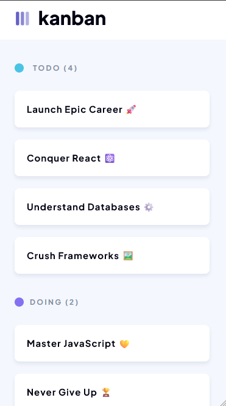

# Responsive Kanban Board

A visually accurate and fully responsive **Kanban board** built to replicate the provided Figma design.  
The application features multiple task columns, styled task cards, and a static side panel for a professional and cohesive user experience.

---

## 🚀 Features

- **Custom Branding**
  - Favicon and page title match the application’s theme.
- **Kanban Board Layout**
  - Multiple columns (e.g., *To Do*, *In Progress*, *Done*) following the exact Figma layout.
- **Pixel-Perfect Styling**
  - Colours, typography, spacing, and shadows match Figma specifications.
- **Fully Responsive**
  - Adapts seamlessly between desktop and mobile views as per Figma’s responsive design.
- **Task Cards**
  - Styled cards with clear titles, borders, padding, and shadows for easy readability.  
  - **Hover effects and transitions** for smooth and engaging interactivity.
- **Static Side Panel**
  - Contains correct icons, text, and branding elements, structured for a polished look.

---

## 📱 Responsiveness

- **Desktop/Laptop** → Full Kanban board with side panel.
- **Mobile** → Compact design that maintains usability and readability.

---

## 🛠️ Tech Stack

- **HTML**  
- **CSS**   

---

## 📸 Preview

### Desktop View

### Mobile View

